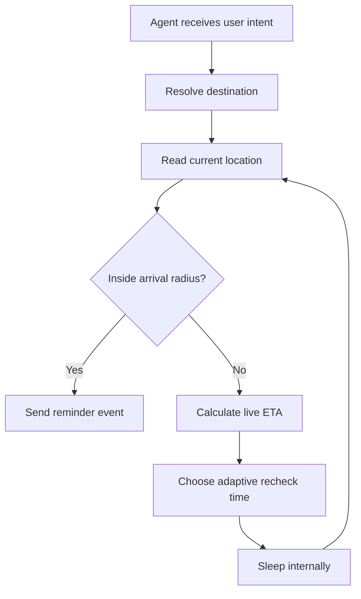

<div align="center">

# AgentPresent

### Real-world context for proactive AI agents

[](https://github.com/aiwithenoch/agentpresent/actions/workflows/ci.yml)
[](LICENSE)
[](https://www.typescriptlang.org/)
[](CONTRIBUTING.md)

**AgentPresent is an open-source context engine that helps AI agents act at the right real-world moment.**

Instead of blindly firing a timer, it checks live context, recalculates arrival time, schedules its own next investigation, and reminds the user only when the condition is actually true.

[Why it exists](#why-it-exists) · [How it works](#how-it-works) · [Quick start](#quick-start) · [Architecture](#architecture) · [Roadmap](#roadmap)

</div>

---

## The idea

A user tells an AI agent:

> “Remind me to take my medicine when I get home.”

A normal reminder system may estimate 55 minutes and notify after 55 minutes.

AgentPresent does something smarter:

1. Resolves where “home” is.
2. Reads the user's current location.
3. Gets a live route estimate.
4. Schedules an internal recheck before the ETA.
5. Wakes up and checks again.
6. Adjusts when traffic, movement, or plans change.
7. Sends the reminder only after arrival is confirmed.

> **The timer does not trigger the reminder. The timer wakes the engine so it can investigate again.**

---

## Why it exists

Most agents are reactive. They wait inside a chat window for another message.

AgentPresent gives them a reusable way to monitor real-world context without forcing every developer to rebuild:

- location monitoring
- destination resolution
- route and ETA checks
- adaptive scheduling
- arrival detection
- cancellation
- agent callbacks

AgentPresent is **not a hosted app**. It is infrastructure developers run inside their own agent stack. Location data does not need to pass through an AgentPresent server.

---

## How it works



### Example timeline

```text
ETA 55 min  → recheck later
ETA 24 min  → recheck sooner
ETA 8 min   → increase check frequency
ETA 2 min   → check closely
Arrived     → notify agent
```

---

## Quick start

```bash
npm install
npm run check
```

```ts
import { AgentPresent } from "agentpresent";

const present = new AgentPresent({
  location: myLocationProvider,
  places: myPlaceProvider,
  routes: myRouteProvider,
  notifier: myAgentCallback,
});

await present.monitor({
  id: "medicine-at-home",
  message: "Take your medicine",
  destination: {
    type: "saved-place",
    placeId: "home",
  },
});
```

The engine stays provider-agnostic. Developers bring their own location source, route provider, saved places, and notification channel.

---

## Architecture

```text
AI agent
   │
   ▼
AgentPresent core
   ├── Intent monitor
   ├── Adaptive scheduler
   ├── Arrival evaluator
   ├── Cancellation controller
   └── Reminder events
          │
          ├── LocationProvider
          ├── PlaceProvider
          ├── RouteProvider
          └── ReminderNotifier
```

### Provider interfaces

```ts
interface LocationProvider {
  getCurrentLocation(): Promise<LocationSnapshot>;
}

interface PlaceProvider {
  resolve(destination: Destination): Promise<Coordinates>;
}

interface RouteProvider {
  estimate(
    origin: Coordinates,
    destination: Coordinates,
  ): Promise<RouteEstimate>;
}

interface ReminderNotifier {
  notify(event: ReminderEvent): Promise<void>;
}
```

Possible adapters include:

| Capability | Providers |
|---|---|
| Routing | Google Routes, Mapbox, HERE, OpenRouteService, OSRM, Valhalla |
| Location | Browser geolocation, mobile runtime, wearable, custom agent client |
| Places | Saved coordinates, geocoding APIs, custom user memory |
| Notification | Agent callback, webhook, push notification, chat message |

---

## Core principles

### Provider-agnostic

AgentPresent does not lock developers into Google, Mapbox, or any specific vendor.

### Privacy-first

Location can remain entirely inside the developer's own infrastructure.

### State-based

A reminder fires because a real-world condition became true, not because a guessed timer expired.

### Adaptive

The engine changes its next check based on distance, ETA, movement, and provider results.

### Agent-native

The final event goes back to an AI agent, which decides how to communicate or act.

---

## Project status

> **Early MVP — active development**

The current repository includes:

- adaptive location monitoring loop
- provider interfaces
- destination resolution
- ETA-based recheck scheduling
- arrival-radius detection
- cancellation support
- runnable TypeScript example
- automated tests
- GitHub Actions CI

---

## Roadmap

- [ ] Persistent reminder store
- [ ] Recovery after process restarts
- [ ] Provider fallback and retry policies
- [ ] Google Routes adapter
- [ ] Mapbox adapter
- [ ] OpenRouteService adapter
- [ ] OSRM adapter
- [ ] MCP server and tools
- [ ] Natural-language intent parser
- [ ] Arrival, departure, nearby, route, and dwell triggers
- [ ] API and battery budget controls
- [ ] Audit events and observability
- [ ] Python package

See [CONTRIBUTING.md](CONTRIBUTING.md) to help build it.

---

## Repository structure

```text
agentpresent/
├── src/                 Core engine and public types
├── examples/            Runnable usage examples
├── test/                Automated tests
├── .github/workflows/   Continuous integration
├── CONTRIBUTING.md      Contributor guide
├── SECURITY.md          Security policy
└── README.md             Project overview
```

---

## Development

```bash
npm install
npm run build
npm test
npm run check
```

Run the provider-agnostic demo:

```bash
npm run example
```

---

## Contributing

Contributions are welcome, especially for:

- routing adapters
- location adapters
- persistence
- scheduling strategies
- MCP integration
- tests and documentation

Please read [CONTRIBUTING.md](CONTRIBUTING.md) before opening a pull request.

---

## Security and privacy

AgentPresent may process highly sensitive location context. Integrations should use explicit user permission, collect the minimum data necessary, avoid unnecessary location history, and make every active monitor easy to inspect and cancel.

Report security concerns through [SECURITY.md](SECURITY.md).

---

## License

Released under the [MIT License](LICENSE).

<div align="center">

**Build agents that know when the moment is right.**

</div>
