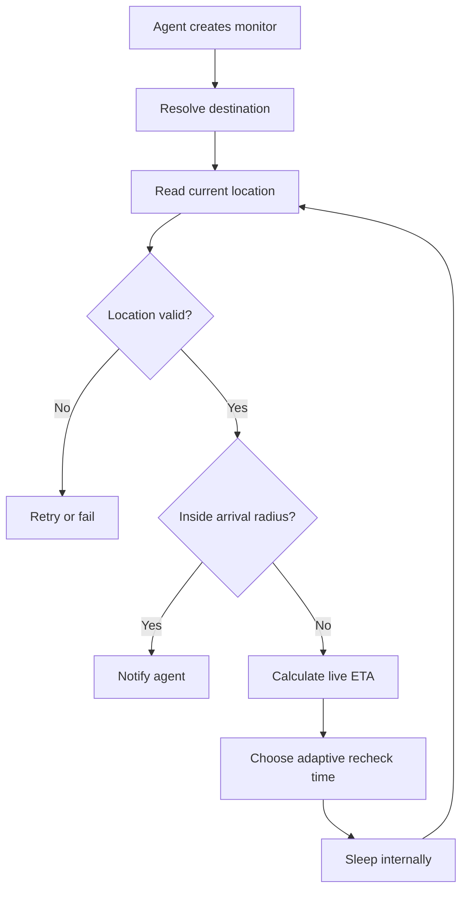

<div align="center">

# AgentPresent

### Real-world context for proactive AI agents

[](https://github.com/aiwithenoch/agentpresent/actions/workflows/ci.yml)
[](LICENSE)
[](https://www.typescriptlang.org/)

**AgentPresent is an open-source context engine that helps AI agents act at the right real-world moment.**

The timer does not fire the reminder. It wakes the engine so it can investigate again.

[How it works](#how-it-works) · [Quick start](#quick-start) · [Reliability](#reliability) · [Architecture](#architecture) · [Roadmap](#roadmap)

</div>

---

## The idea

A user tells an AI agent:

> “Remind me to take my medicine when I get home.”

AgentPresent resolves “home,” reads the latest location, asks a routing provider for an ETA, schedules an internal recheck, and repeats until the arrival condition is true.

It is a library, not a hosted app. Developers run it inside their own agent stack and provide their own location, place, route, notification, and telemetry adapters.

---

## How it works



```text
ETA 55 min  → recheck later
ETA 24 min  → recheck sooner
ETA 8 min   → increase check frequency
ETA 2 min   → check at the configured minimum interval
Arrived     → notify agent
```

Arrival currently uses straight-line Haversine distance against a configurable radius. Routing is used to schedule the next check, not to prove arrival. Integrators should choose a conservative radius for rivers, overpasses, gated sites, and dense buildings.

---

## Quick start

```bash
npm install
npm run check
npm run example
```

```ts
import { AgentPresent } from "agentpresent";

const present = new AgentPresent({
  location: myLocationProvider,
  places: myPlaceProvider,
  routes: myRouteProvider,
  notifier: myAgentCallback,
  telemetry: myTelemetrySink,
});

const handle = present.monitor({
  id: "medicine-at-home",
  message: "Take your medicine",
  destination: {
    type: "saved-place",
    placeId: "home",
  },
  maximumDurationMs: 6 * 60 * 60_000,
  maximumChecks: 200,
  maximumLocationAgeMs: 60_000,
  maximumAccuracyMeters: 100,
});

// monitor() returns immediately, so the agent can keep working.
console.log(handle.id);

// Optional: observe the final lifecycle result.
console.log(await handle.completion);

// Optional: cancel from the handle or engine.
handle.cancel();
```

---

## Reliability

AgentPresent includes the controls required for long-running monitors:

- exponential retry with configurable limits
- transient-versus-fatal error classification
- explicit `retrying`, `cancelled`, `expired`, and `failed` lifecycle states
- maximum duration and maximum check budgets
- stale-location and accuracy validation
- separate telemetry and user-notification channels
- non-blocking monitor handles with observable completion

The default monitor lifetime is 24 hours with a 500-check budget. Applications should tune these values for their API costs, battery strategy, and use case.

---

## Architecture

```text
AI agent
   │
   ▼
AgentPresent core
   ├── Non-blocking monitor handles
   ├── Adaptive scheduler
   ├── Retry and backoff policy
   ├── Location quality checks
   ├── Arrival evaluator
   ├── Duration/check budgets
   └── Lifecycle events
          │
          ├── LocationProvider
          ├── PlaceProvider
          ├── RouteProvider
          ├── ReminderNotifier
          └── TelemetrySink
```

### Provider interfaces

```ts
interface LocationProvider {
  getCurrentLocation(): Promise<LocationSnapshot>;
}

interface PlaceProvider {
  resolve(destination: Destination): Promise<Coordinates>;
}

interface RouteProvider {
  estimate(origin: Coordinates, destination: Coordinates): Promise<RouteEstimate>;
}

interface ReminderNotifier {
  notify(event: ReminderEvent): Promise<void>;
}

interface TelemetrySink {
  record(event: ReminderEvent): Promise<void>;
}
```

| Capability | Possible providers |
|---|---|
| Routing | Google Routes, Mapbox, HERE, OpenRouteService, OSRM, Valhalla |
| Location | Browser geolocation, mobile runtime, wearable, custom agent client |
| Places | Saved coordinates, geocoding APIs, custom user memory |
| Notification | Agent callback, webhook, push notification, chat message |
| Telemetry | Logs, OpenTelemetry, event store, custom audit sink |

---

## Project status

> **Early MVP — active development**

Implemented:

- [x] provider-agnostic core
- [x] adaptive ETA-based rechecks
- [x] non-blocking monitor handles
- [x] cancellation lifecycle events
- [x] retry and exponential backoff
- [x] duration and check budgets
- [x] location age and accuracy validation
- [x] separate notifier and telemetry channels
- [x] runnable TypeScript example
- [x] automated tests and GitHub Actions CI

---

## Roadmap

- [ ] Persistent reminder store
- [ ] Recovery after process restarts
- [ ] Route-aware arrival strategies
- [ ] Provider-specific error classifiers
- [ ] Google Routes adapter
- [ ] Mapbox adapter
- [ ] OpenRouteService adapter
- [ ] OSRM adapter
- [ ] MCP server and tools
- [ ] Natural-language intent parser
- [ ] Arrival, departure, nearby, route, and dwell triggers
- [ ] Audit events and observability package
- [ ] Python package

---

## Development

```bash
npm install
npm run build
npm run typecheck:examples
npm test
npm run check
npm run example
```

## Contributing

Contributions are welcome. Read [CONTRIBUTING.md](CONTRIBUTING.md) before opening a pull request.

## Security and privacy

Location context is sensitive. Integrations should request explicit permission, collect the minimum data required, avoid unnecessary history, and make every active monitor easy to inspect and cancel. See [SECURITY.md](SECURITY.md).

## License

Released under the [MIT License](LICENSE).

<div align="center">

**Build agents that know when the moment is right.**

</div>
